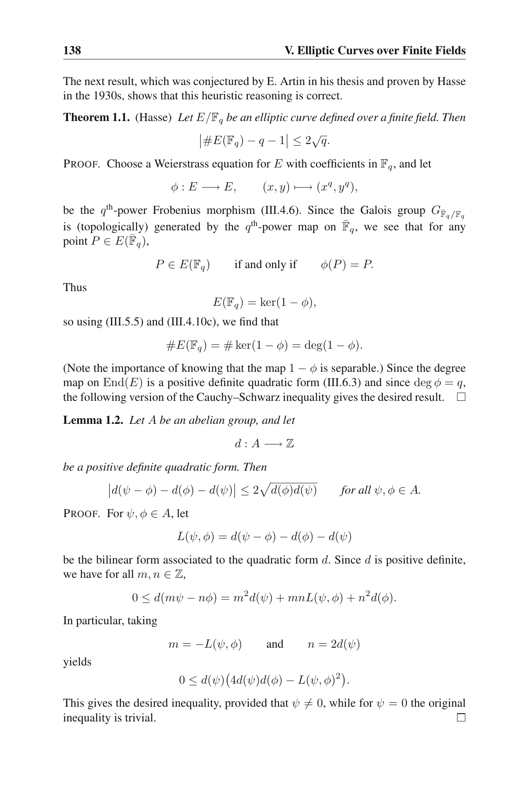
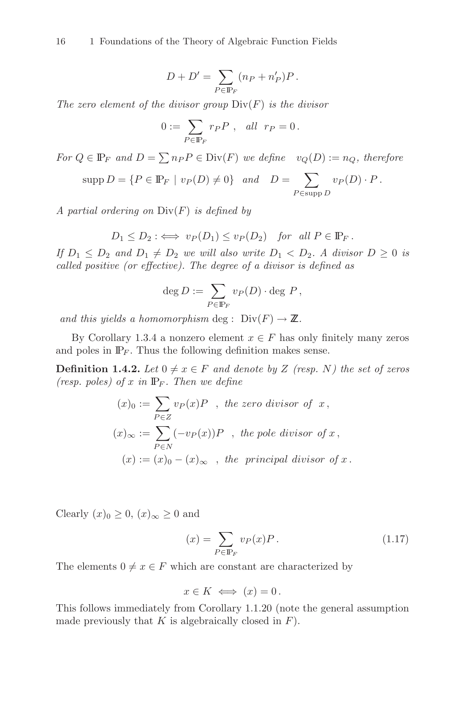
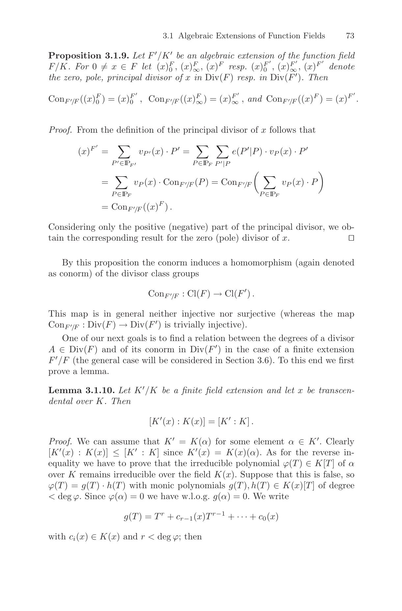
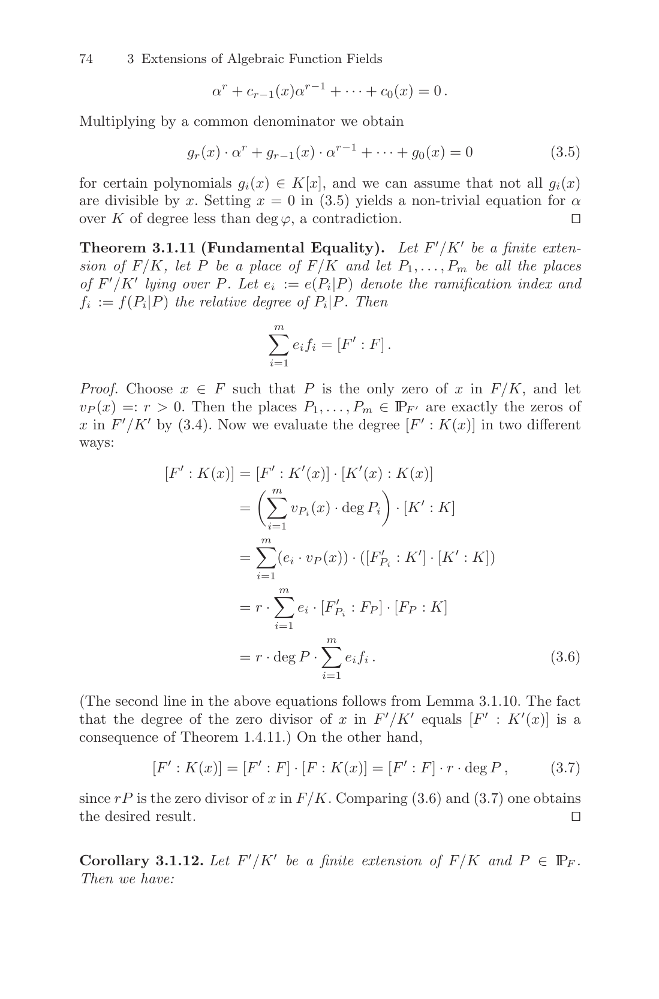
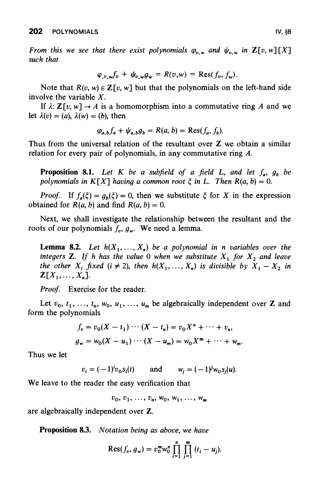
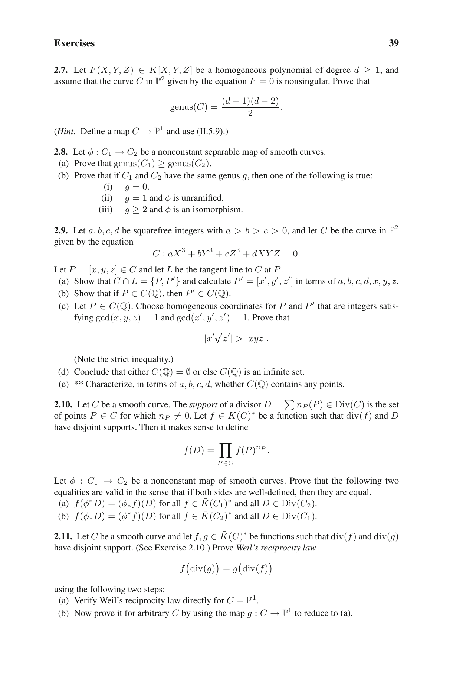
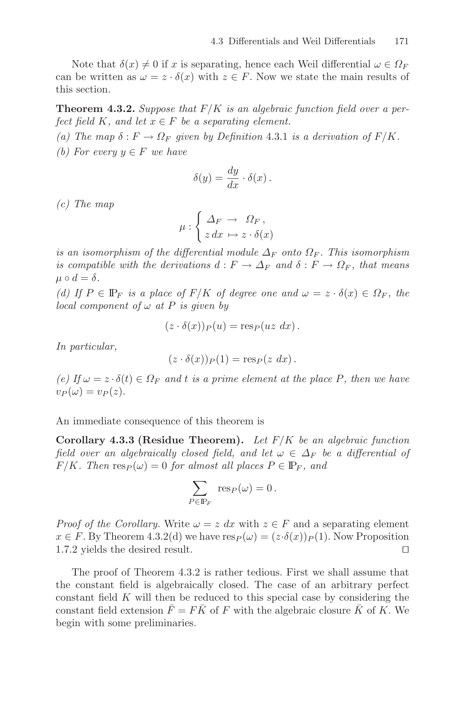

# Formal Proofs for Eagen/Bassa/Parker Divisor Techniques

Lean 4 formalization of divisor-based techniques for elliptic-curve
inner-product and discrete-log protocols, including Eagen-style divisor
construction, Bassa-style norm/resultant arguments, Parker admissibility
variants, and the MA/IP soundness and completeness theorems.

## Build

```
lake build
```

Requires elan + Lean 4 toolchain (see `lean-toolchain`).

## Theorem Surface

The headline theorems live in `Divisor/ExtractorBridgeTheorems.lean` and
`Divisor/Soundness.lean`.

### Soundness

#### `Divisor.ma_extractable`

Lean:
```lean
theorem ma_extractable
    (stmt : DlogStatement E.q) (hd : stmt.degBound < E.q)
    (hd2 : 2 ≤ stmt.degBound)
    (msg : MAProverMsg E.q)
    (hkm : stmt.k = msg.k)
    (hTargetOnE : stmt.target ∈ E.points)
    (hBasesOnE : ∀ j, stmt.bases j ∈ E.points)
    (hLargeQ : E.points.card >
        2 * (5 * (msg.toD.degE + stmt.k + 2) + 3) +
        21 * (msg.toD.degE + stmt.k + 2) + 72) :
    (∃ wit : DlogWitness E.q,
        maExtractor E stmt msg stmt.degBound hd hkm = some wit
        ∧ relDlog E stmt wit) ∨
    ((validPairs E).filter
        (fun p => maVerifierAccepts E stmt msg ⟨p.1, p.2⟩ hkm)).card
      ≤ eventNotEqBound E stmt.degBound stmt.k +
        eventDegBound E stmt.degBound stmt.k
```

Statement: for every MA first-round message, either the extractor returns a
valid discrete-log witness, or the verifier's accepting challenge set is
bounded by the sum of the defined-zero discrepancy bound and the undefined
denominator bound.

Human form: either `msg` yields an extracted witness $w$ with
$$
T = \sum_i [w_i] B_i,
$$
or its accepting challenges are bounded by
$$
\left|\operatorname{AcceptingChallenges}(\mathrm{msg})\right|
\le 18(d+k)q + (3d+9k+71)\left|E(\mathbb{F}_q)\right|.
$$

#### `Divisor.ma_extractable_clean`

Lean:
```lean
theorem ma_extractable_clean
    (stmt : DlogStatement E.q) (hd : stmt.degBound < E.q)
    (hd2 : 2 ≤ stmt.degBound)
    (msg : MAProverMsg E.q)
    (hkm : stmt.k = msg.k)
    (hTargetOnE : stmt.target ∈ E.points)
    (hBasesOnE : ∀ j, stmt.bases j ∈ E.points)
    (hLargeQ : E.points.card >
        2 * (5 * (msg.toD.degE + stmt.k + 2) + 3) +
        21 * (msg.toD.degE + stmt.k + 2) + 72)
    (hQ : 5 ≤ E.q) :
    (∃ wit : DlogWitness E.q,
        maExtractor E stmt msg stmt.degBound hd hkm = some wit
        ∧ relDlog E stmt wit) ∨
    ((validPairs E).filter
        (fun p => maVerifierAccepts E stmt msg ⟨p.1, p.2⟩ hkm)).card
      ≤ 36 * (stmt.degBound + stmt.k + 4) * E.q
```

Statement: the same MA extractability disjunction, with the accept-set bound
consolidated through Hasse to a single `q`-term.

Human form: either `msg` yields an extracted witness, or
$$
\left|\operatorname{AcceptingChallenges}(\mathrm{msg})\right|
\le 36(d+k+4)q.
$$

#### `Divisor.ip_knowledge_sound`

Lean:
```lean
theorem ip_knowledge_sound
    (stmt : DlogStatement E.q) (hd : stmt.degBound < E.q)
    (hd2 : 2 ≤ stmt.degBound)
    (msg1 : MAProverMsg E.q)
    (hkm : stmt.k = msg1.k)
    (hTargetOnE : stmt.target ∈ E.points)
    (hBasesOnE : ∀ j, stmt.bases j ∈ E.points)
    (hLargeQ : E.points.card >
        2 * (5 * (msg1.toD.degE + stmt.k + 2) + 3) +
        21 * (msg1.toD.degE + stmt.k + 2) + 72) :
    ((∃ wit : DlogWitness E.q,
         maExtractor E stmt msg1 stmt.degBound hd hkm = some wit
         ∧ relDlog E stmt wit) ∨
     ((validPairs E).filter
        (fun p => maVerifierAccepts E stmt msg1 ⟨p.1, p.2⟩ hkm)).card
      ≤ eventNotEqBound E stmt.degBound stmt.k +
        eventDegBound E stmt.degBound stmt.k)
    ∧ ∀ (chal : MAChallenge E.q) (A₂ : ZMod E.q × ZMod E.q)
        (msg3 msg3' : IPProverMsg3 E.q),
        msg1.toD.eval chal.A₀.1 chal.A₀.2 ≠ 0 →
        msg1.toD.eval chal.A₁.1 chal.A₁.2 ≠ 0 →
        msg1.toD.eval A₂.1 A₂.2 ≠ 0 →
        (lineThrough chal.A₀.1 chal.A₀.2 chal.A₁.1 chal.A₁.2).eval
            stmt.target.1 (-stmt.target.2) ≠ 0 →
        ipVerifierAccepts E stmt msg1 chal A₂ msg3 →
        ipVerifierAccepts E stmt msg1 chal A₂ msg3' →
        msg3 = msg3'
```

Statement: the IP has the same witness-or-small-accept-set guarantee as the
MA, and the third-round response is unique whenever the non-vanishing side
conditions for the verifier hold.

Human form:
$$
\text{IP soundness}
= \text{MA extractability}
\land \text{uniqueness of any accepted third-round response}.
$$

#### `Divisor.ip_knowledge_sound_clean`

Lean:
```lean
theorem ip_knowledge_sound_clean
    (stmt : DlogStatement E.q) (hd : stmt.degBound < E.q)
    (hd2 : 2 ≤ stmt.degBound)
    (msg1 : MAProverMsg E.q)
    (hkm : stmt.k = msg1.k)
    (hTargetOnE : stmt.target ∈ E.points)
    (hBasesOnE : ∀ j, stmt.bases j ∈ E.points)
    (hLargeQ : E.points.card >
        2 * (5 * (msg1.toD.degE + stmt.k + 2) + 3) +
        21 * (msg1.toD.degE + stmt.k + 2) + 72)
    (hQ : 5 ≤ E.q) :
    ((∃ wit : DlogWitness E.q,
         maExtractor E stmt msg1 stmt.degBound hd hkm = some wit
         ∧ relDlog E stmt wit) ∨
     ((validPairs E).filter
        (fun p => maVerifierAccepts E stmt msg1 ⟨p.1, p.2⟩ hkm)).card
      ≤ 36 * (stmt.degBound + stmt.k + 4) * E.q)
    ∧ ∀ (chal : MAChallenge E.q) (A₂ : ZMod E.q × ZMod E.q)
        (msg3 msg3' : IPProverMsg3 E.q),
        msg1.toD.eval chal.A₀.1 chal.A₀.2 ≠ 0 →
        msg1.toD.eval chal.A₁.1 chal.A₁.2 ≠ 0 →
        msg1.toD.eval A₂.1 A₂.2 ≠ 0 →
        (lineThrough chal.A₀.1 chal.A₀.2 chal.A₁.1 chal.A₁.2).eval
            stmt.target.1 (-stmt.target.2) ≠ 0 →
        ipVerifierAccepts E stmt msg1 chal A₂ msg3 →
        ipVerifierAccepts E stmt msg1 chal A₂ msg3' →
        msg3 = msg3'
```

Statement: the Hasse-clean IP soundness theorem, using the same
`36(d + k + 4)q` accept-set bound as `ma_extractable_clean`.

Human form:
$$
\text{IP clean soundness}
= \text{MA clean extractability}
\land \text{uniqueness of any accepted third-round response}.
$$

### Completeness

#### `Divisor.ma_completeness`

Lean:
```lean
theorem ma_completeness
    (stmt : DlogStatement E.q) (wit : DlogWitness E.q)
    (hk : stmt.k = wit.k) (hValid : relDlog E stmt wit)
    (msg : MAProverMsg E.q) (hkm : stmt.k = msg.k)
    (hDeg : msg.toD.degE ≤ wit.degBound)
    (hDegK : msg.toD.degE ≤ stmt.degBound)
    (hAdm : stmt.admSet (msg.polyA, msg.polyB))
    (hHonestDivisor : msg.isHonestFor E stmt wit hk hkm) :
    ((E.points ×ˢ E.points).filter
        (fun p => ¬ maVerifierAccepts E stmt msg ⟨p.1, p.2⟩ hkm)).card
      ≤ (3 * numZeros E msg.toD + 4) * E.numAffine
```

Statement: for an honest MA prover message, the verifier rejects only on a
bounded bad-challenge set controlled by the number of affine zeros of the
message divisor.

Human form:
$$
\left|\operatorname{RejectingChallenges}(\mathrm{msg})\right|
\le \left(3\,\operatorname{numZeros}(D)+4\right)
   \left|E_{\mathrm{aff}}(\mathbb{F}_q)\right|.
$$

#### `Divisor.ma_completeness_clean`

Lean:
```lean
theorem ma_completeness_clean
    (stmt : DlogStatement E.q) (wit : DlogWitness E.q)
    (hk : stmt.k = wit.k) (hValid : relDlog E stmt wit)
    (msg : MAProverMsg E.q) (hkm : stmt.k = msg.k)
    (hDeg : msg.toD.degE ≤ wit.degBound)
    (hDegK : msg.toD.degE ≤ stmt.degBound)
    (hAdm : stmt.admSet (msg.polyA, msg.polyB))
    (hHonestDivisor : msg.isHonestFor E stmt wit hk hkm)
    (hD : ¬ (msg.toD.a = 0 ∧ msg.toD.b = 0))
    (hQ : 5 ≤ E.q) :
    ((E.points ×ˢ E.points).filter
        (fun p => ¬ maVerifierAccepts E stmt msg ⟨p.1, p.2⟩ hkm)).card
      ≤ (6 * (stmt.degBound + 1) + 6) * E.q
```

Statement: the Hasse-clean MA completeness theorem, replacing the affine point
count and zero count by a single expression in `q` and the statement degree
bound.

Human form:
$$
\left|\operatorname{RejectingChallenges}(\mathrm{msg})\right|
\le (6(d+1)+6)q.
$$

## Axiom Surface

The pinned theorem closures are checked by `#print axioms` in
`Tests/AxiomClosurePin.lean`.

The bridge-gap execution plan is tracked in
[`axioms/gaps.md`](axioms/gaps.md). In that file, a gap means a
textbook-to-Lean specialization gap, not a Lean `sorry`.

`Divisor.ma_extractable` and `Divisor.ip_knowledge_sound` depend on the
following project axioms, in addition to Lean/mathlib infrastructure
(`propext`, `Classical.choice`, `Quot.sound`):

```text
Divisor.chord_fiber_product_concrete_bar_zfiber_pow_dvd
Polynomial.resultant_logDeriv_at_split_specialization_of_two_le_natDegree_pos_g
Divisor.hasse_weil_textbook
Divisor.CoordRingElt.divisorClass_eq_zero_of_b_ne_zero
```

`Divisor.ma_completeness` depends on:

```text
Divisor.chord_fiber_product_eq_normZ_under_split
Polynomial.resultant_logDeriv_at_split_specialization_of_two_le_natDegree_pos_g
```

`Divisor.ma_completeness_clean` additionally uses:

```text
Divisor.hasse_weil_textbook
```

### Lean Axiom Inventory

These are the project-level `axiom` declarations. Some are headline
dependencies; others are lower-level textbook targets or compatibility
surfaces.

#### `Divisor.hasse_weil_textbook`

Lean:
```lean
axiom hasse_weil_textbook (E : ECSetup) :
  |(((E.numPoints : ℤ) - E.q - 1 : ℤ) : ℝ)| ≤ 2 * Real.sqrt (E.q : ℝ)
```

Source statement: Silverman, *The Arithmetic of Elliptic Curves*, Theorem
V.1.1 states the Hasse bound verbatim
$$
\left|\#E(\mathbb{F}_q)-q-1\right| \le 2\sqrt{q}.
$$

This is the closure axiom. The legacy integer-squared form
`Divisor.hasse_weil` is now a *theorem* derived from it:
$$
\left(\#E(\mathbb{F}_q)-q-1\right)^2 \le 4q.
$$

Textbook snippet:



Lean source: `Divisor/Axioms/AxiomHasseWeil.lean`.

#### `Divisor.principal_divisor_iff`

Lean:
```lean
axiom principal_divisor_iff
    (E : ECSetup) (coeffs : ECPoint E → ℤ)
    (hFinSupp : Set.Finite (Function.support coeffs)) :
    IsPrincipal E coeffs ↔
      (∑ P ∈ hFinSupp.toFinset, coeffs P = 0) ∧
      (ECPoint.weightedSum E hFinSupp.toFinset
          (fun P => ECPoint.zsmul E (coeffs P) P) = 0)
```

Source statement: Silverman, *The Arithmetic of Elliptic Curves*, Corollary
III.3.5 states that a divisor
$$
D = \sum_P n_P(P)
$$
on an elliptic curve is principal iff
$$
\sum_P n_P = 0
\qquad\text{and}\qquad
\sum_P [n_P]P = O_E.
$$

Lean specialization: the coefficient function `coeffs : ECPoint E → ℤ` is
principal exactly when its finite support has integer sum zero and group-law
weighted sum zero.

Textbook snippet:


Lean source: `Divisor/Axioms/AxiomPrincipalDivisorIff.lean`.

#### `Divisor.CoordRingElt.divisorClass_eq_zero_of_b_ne_zero`

Lean:
```lean
axiom CoordRingElt.divisorClass_eq_zero_of_b_ne_zero
    (E : ECSetup) (D : CoordRingElt E.q)
    (_hD : ¬ (D.a = 0 ∧ D.b = 0))
    (_hSplit : splitsOnE E D) (_hbNZ : D.b ≠ 0) :
    divisorClass E (divisorOfD E D)
      (divisorOfD_finiteSupport E D) = 0
```

Source statement: Silverman II.3 defines the divisor of a rational function by
local orders, Stichtenoth Def. 1.4.2 names such divisors principal, and
Silverman Corollary III.3.5 characterizes principal divisors on elliptic
curves by degree and group-law sum.

Lean specialization: for nonzero $D = a(x)-b(x)y$ with $b\ne 0$, if
`splitsOnE E D` exposes the relevant divisor mass over `F_q`, then the class
of `divisorOfD E D` is zero.

Textbook snippets:





Lean source: `Divisor/OrdP/LocalRing.lean`.

#### `Divisor.chord_fiber_product_concrete_bar_zfiber_pow_dvd`

Lean:
```lean
axiom chord_fiber_product_concrete_bar_zfiber_pow_dvd
    (E : ECSetup) (D : CoordRingElt E.q) (lam : ZMod E.q)
    [DecidableEq (Fqbar E)]
    (hD : ¬ (D.a = 0 ∧ D.b = 0))
    (gd : GeometricDivisorData E D) (z : Fqbar E) :
    (Polynomial.X - Polynomial.C z) ^
      (∑ Q ∈ gd.support.filter
         (fun Q => zLambdaBar E lam Q = z), gd.mult Q)
      ∣ (chord_fiber_product_concrete E lam D).map
          (algebraMap (ZMod E.q) (Fqbar E))
```

Source statement: Stacks Project tag 02RS gives the norm pushforward identity
$$
p_*\operatorname{div}(f)=\operatorname{div}(\operatorname{Nm}(f)).
$$
Stichtenoth Prop. 3.1.9 supplies the supporting principal-divisor conorm
statement.

Lean specialization: for the chord projection `π_λ`, the base-changed
chord-fiber resultant has at least the pushed-forward zero-divisor
multiplicity at each `z`:
$$
(X-z)^{\sum_{Q:\pi_\lambda(Q)=z}\operatorname{mult}_Q(D)}
\mid N_{\pi_\lambda}(D)(X).
$$

Source material:

[Stacks Project tag 02RS local archive](axioms/papers/stacks-02RS.html)



Lean source: `Divisor/Axioms/AxiomChordFiberDivisibility.lean`.

#### `Divisor.chord_fiber_product_eq_normZ_under_split`

Lean:
```lean
axiom chord_fiber_product_eq_normZ_under_split
    (E : ECSetup) (D : CoordRingElt E.q) (lam : ZMod E.q)
    (hD : ¬ (D.a = 0 ∧ D.b = 0))
    (hSplitOnE : splitsOnE E D)
    (β_fun : ZMod E.q × ZMod E.q → ℕ)
    (hβsup : ∀ P, β_fun P ≠ 0 → P ∈ E.points ∧ D.eval P.1 P.2 = 0)
    (hβcov : ∀ P ∈ E.points, D.eval P.1 P.2 = 0 → β_fun P ≠ 0)
    (hAccount : (∑ P ∈ E.points, β_fun P) =
                  (normPoly E D).natDegree)
    (hβtrue : ∀ P, β_fun P = betaTrue E D hD P) :
    ∃ c : ZMod E.q, c ≠ 0 ∧
      chord_fiber_product E lam D = C c * normZ E lam D β_fun
```

Source statement: Stacks Project tag 02RS gives
$$
p_*\operatorname{div}(f)=\operatorname{div}(\operatorname{Nm}(f)).
$$
Stichtenoth Thm. 3.1.11 gives the finite extension place-accounting equality
$$
\sum_i e_i f_i = [F' : F].
$$

Lean specialization: under `splitsOnE` and pointwise true multiplicity
accounting, the chord-fiber product is a nonzero scalar multiple of
`normZ E lam D β_fun`.

Source material:

[Stacks Project tag 02RS local archive](axioms/papers/stacks-02RS.html)




Lean source: `Divisor/Axioms/AxiomChordFiberProductEqNormZUnderSplit.lean`.

#### `Polynomial.resultant_logDeriv_at_split_specialization_of_two_le_natDegree_pos_g`

Lean:
```lean
axiom resultant_logDeriv_at_split_specialization_of_two_le_natDegree_pos_g
    {K : Type*} [Field K]
    (f g : K[X][X]) (t₀ : K)
    (hMonic : f.Monic)
    (hf_two_le : 2 ≤ f.natDegree)
    (hg_pos : 0 < g.natDegree)
    (hF_ne : (Polynomial.resultant f g f.natDegree g.natDegree).eval t₀ ≠ 0)
    (hSplit : (f.map (Polynomial.evalRingHom t₀)).Splits)
    (hg_def : ∀ x ∈ (f.map (Polynomial.evalRingHom t₀)).roots,
        (g.map (Polynomial.evalRingHom t₀)).eval x ≠ 0)
    (hf_X_def : ∀ x ∈ (f.map (Polynomial.evalRingHom t₀)).roots,
        ((f.map (Polynomial.evalRingHom t₀)).derivative).eval x ≠ 0) :
  resultantLogDerivConclusion f g t₀
```

Source statement: Lang IV.8 identifies resultants as products over roots,
Lang VI.5 gives norm and trace as products and sums over embeddings, and
Lang VIII.5 gives the separable algebraic derivative formula
$$
\xi' = -\frac{f^D(\xi)}{f'(\xi)}.
$$

Lean specialization: for
$$
F(T)=\operatorname{Res}_X(f(X,T),g(X,T)),
$$
with `f` monic, $\deg_X f \ge 2$, $\deg_X g > 0$, and $f(X,t_0)$
split with simple roots where `g` is nonzero,
$$
\frac{F'(t_0)}{F(t_0)}
= \sum_{x:\,f(x,t_0)=0}
  \frac{g_T f_X - g_X f_T}{f_X g}(x,t_0).
$$

Textbook snippets:




Lean source: `Divisor/Axioms/AxiomResultantLogDerivAtSplit.lean`.

#### `Differential.logDeriv_algebraNorm_eq_algebraTrace_logDeriv`

Lean:
```lean
axiom logDeriv_algebraNorm_eq_algebraTrace_logDeriv
    {F K : Type*} [Field F] [Field K]
    [Differential F] [Differential K]
    [Algebra F K] [DifferentialAlgebra F K]
    [FiniteDimensional F K] [Algebra.IsSeparable F K]
    (α : K) (hα : α ≠ 0) :
  Differential.logDeriv (Algebra.norm F α)
    = Algebra.trace F K (Differential.logDeriv α)
```

Source statement: Lang VI.5 gives
$$
N^E_k(\alpha)=\prod_\sigma \sigma(\alpha)
\qquad\text{and}\qquad
\operatorname{Tr}^E_k(\alpha)=\sum_\sigma \sigma(\alpha)
$$
for a separable extension, while Lang VIII.5 gives the compatible extension
of derivations to separable algebraic extensions.

Lean specialization: for a finite separable differential field extension
$K/F$ and $\alpha \in K^\times$,
$$
\frac{d(N_{K/F}\alpha)}{N_{K/F}\alpha}
= \operatorname{Tr}_{K/F}\left(\frac{d\alpha}{\alpha}\right).
$$

Textbook snippets:


Lean source: `Divisor/Axioms/AxiomTraceLogDeriv.lean`.

#### `Divisor.weil_reciprocity_textbook`

Lean:
```lean
axiom weil_reciprocity_textbook
    (E : ECSetup) (f g : CoordRingElt E.q)
    (hf : ¬ (f.a = 0 ∧ f.b = 0))
    (hg : ¬ (g.a = 0 ∧ g.b = 0))
    (hDisjointSupport :
      ∀ P ∈ E.points,
        (f.eval P.1 P.2 = 0 → g.eval P.1 P.2 ≠ 0) ∧
        (g.eval P.1 P.2 = 0 → f.eval P.1 P.2 ≠ 0)) :
    ∏ P ∈ E.points.filter (fun P => g.eval P.1 P.2 = 0),
      f.eval P.1 P.2
    =
    ∏ P ∈ E.points.filter (fun P => f.eval P.1 P.2 = 0),
      g.eval P.1 P.2
```

Source statement: Silverman Exercise II.2.11 states Weil reciprocity as
$$
f(\operatorname{div} g)=g(\operatorname{div} f)
$$
for rational functions with disjoint divisor support.
Stichtenoth Corollary 4.3.3 gives the residue theorem behind the
logarithmic-differential proof.

Lean specialization: for nonzero coordinate-ring representatives `f,g` with
disjoint zero supports on `E.points`, the two finite products over the
corresponding zero sets are equal.

Textbook snippets:





Lean source: `Divisor/Axioms/AxiomWeilReciprocity.lean`.

Related theorem-backed declarations: `CoordRingElt.exists_divisor_multiplicity`
is proved from `ordAt`/`divisorClass_eq_zero_of_b_ne_zero`,
`bivariate_poly_zeros_on_ExE_le` is a theorem whose project-axiom dependency is
`Divisor.hasse_weil_textbook`, and `Divisor.hasse_weil` is itself a theorem
derived from `Divisor.hasse_weil_textbook` for downstream compatibility.
