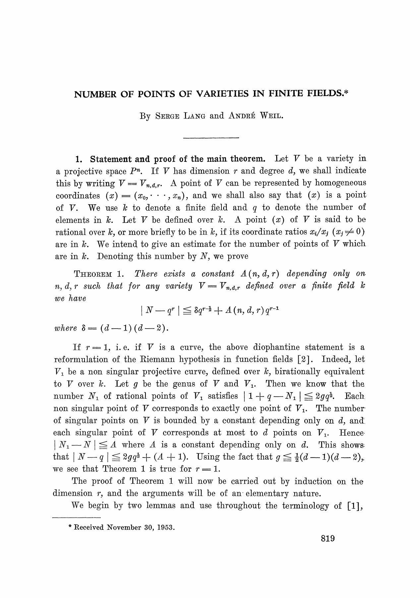
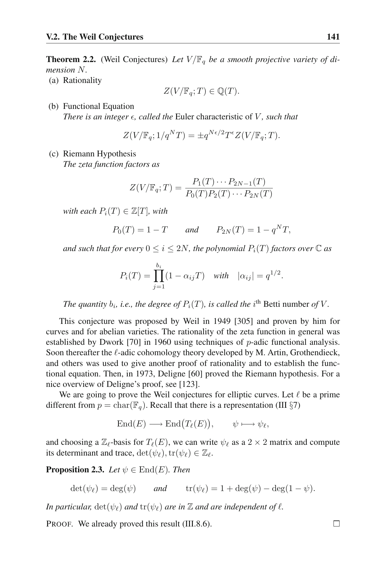
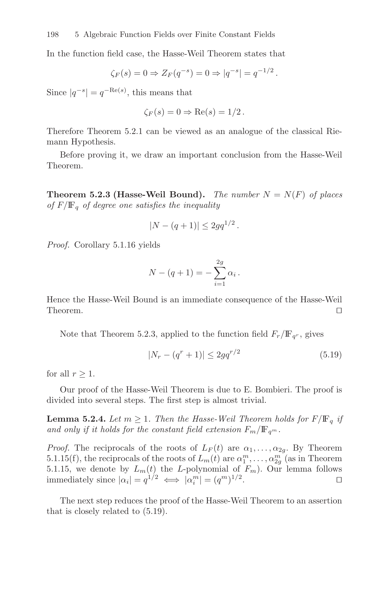

# `bivariate_poly_zeros_on_ExE_le` (planned, 10th axiom)

- **Lean source**: planned, not yet added. Per `docs/bivariate-sz-paper-faithful.md`, Phase 5 adds this to `Divisor/Axioms.lean` to achieve the paper-faithful `18·(d+k+6)·|E|` MA-extractor constant.

```lean
axiom bivariate_poly_zeros_on_ExE_le
    (E : ECSetup) (f : FourVarPoly E.q) (dX dY : ℕ)
    (hBidegX : bi_x_degree_le E f dX dY)
    (hNonzero : f %ₘ₂ (curveEq₀ E, curveEq₁ E) ≠ 0) :
    ((E.points ×ˢ E.points).filter
      (fun p => bivEval₂ f p.1 p.2 = 0)).card
      ≤ 2 * (dX + dY) * E.points.card
```

Weil / Lang–Weil bound on F_q-points of a non-zero bivariate curve cut out on `E × E`.

## Citation

Primary:

- **Lang & Weil**, *"Number of Points of Varieties in Finite Fields"*, American Journal of Mathematics **76** (1954), pp. 819–827 — **Theorem 1**, p. 819.

Supporting (already axiomatised / textbook form for single curves):

- Stichtenoth, *Algebraic Function Fields and Codes* (GTM 254, 2nd ed.), **Theorem 5.2.3 (Hasse–Weil Bound)**, p. 198 — for a single curve.
- Silverman, *The Arithmetic of Elliptic Curves* (GTM 106), **Theorem V.1.1 (Hasse)**, p. 138 — for one elliptic curve.
- Silverman AEC **Theorem V.2.2 (Weil Conjectures)**, p. 141 — for smooth projective varieties.

## Verbatim

Lang–Weil 1954, Theorem 1:

> Theorem 1. There exists a constant A(n, d, r) depending only on n, d, r such that for any variety V = V_{n,d}^r defined over a finite field k we have
>
> |N − q^r| ≤ (d − 1)(d − 2)·q^{r − 1/2} + A(n, d, r)·q^{r − 1}.

Silverman V.2.2 (supporting, closest textbook form):

> Theorem 2.2. (Weil Conjectures) Let V/F_q be a smooth projective variety of dimension N. …

Stichtenoth 5.2.3 (supporting, single-curve Hasse–Weil Bound):

> Theorem 5.2.3 (Hasse–Weil Bound). The number N = N(F) of places of F/F_q of degree one satisfies the inequality
>
> |N − (q + 1)| ≤ 2g·q^{1/2}.

## Snippets







## Provenance note (from the plan)

The axiom would follow from combining:

- `hasse_weil` (already axiomatised, single curve),
- absolute irreducibility of `E × E` (product of two absolutely irreducible curves),
- Bezout's theorem for hypersurface-in-surface intersection,
- Lang–Weil's point-count for curves on a surface.

Fully formalising these would take months. Stating the compound form as a single axiom with textbook citation matches the style used for `principal_divisor_iff` and `hasse_weil`.

## Status

Primary source obtained (Lang–Weil 1954, `papers/lang-weil-1954.pdf`). Axiom has citation coverage.
