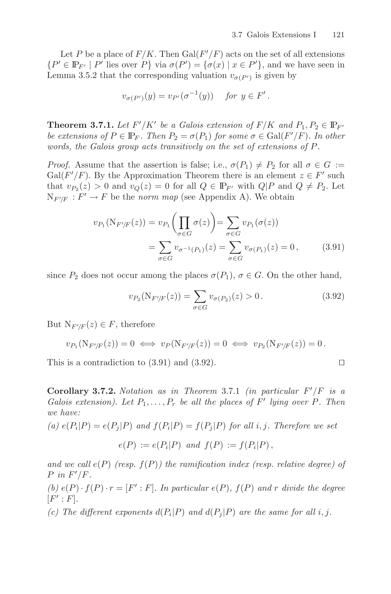

# `chord_fiber_product_eq_normZ_under_split`

- **Lean source**: `Divisor/ChordLogDerivProof.lean:149`

```lean
axiom chord_fiber_product_eq_normZ_under_split
    (E : ECSetup) (D : CoordRingElt E.q) (lam : ZMod E.q)
    (hD : ¬ (D.a = 0 ∧ D.b = 0))
    (hSplit : normPoly_splits_over_Fq E D)
    (hAccount : (∑ P ∈ E.points, betaConstructive E D P) =
                  (normPoly E D).natDegree) :
    ∃ c : ZMod E.q, c ≠ 0 ∧ chord_fiber_product E lam D = C c * normZ E lam D
```

Identifies the function-field norm `N_{F_q(E)/F_q(z)}(D)` (the chord-fiber product) with a nonzero constant multiple of `normZ` under the splitting hypothesis.

## Citation

Stichtenoth, *Algebraic Function Fields and Codes* (GTM 254, 2nd ed.):

- **Proposition 3.1.9**, p. 73 — conorm of a principal divisor is principal.
- **Theorem 3.7.1**, p. 121 — the Galois group acts transitively on the extensions of a place.

The two combine to match the F_q-rational roots and multiplicities of `N(D)(z)` with those of `normZ(z)`.

## Verbatim

Stichtenoth 3.1.9:

> Proposition 3.1.9. Let F′/K′ be an algebraic extension of the function field F/K. For 0 ≠ x ∈ F let (x)₀^F, (x)∞^F, (x)^F resp. (x)₀^{F′}, (x)∞^{F′}, (x)^{F′} denote the zero, pole, principal divisor of x in Div(F) resp. in Div(F′). Then
>
> Con_{F′/F}((x)₀^F) = (x)₀^{F′},
> Con_{F′/F}((x)∞^F) = (x)∞^{F′},   and
> Con_{F′/F}((x)^F)  = (x)^{F′}.

Stichtenoth 3.7.1:

> Theorem 3.7.1. Let F′/K′ be a Galois extension of F/K and P₁, P₂ ∈ IP_{F′} be extensions of P ∈ IP_F. Then P₂ = σ(P₁) for some σ ∈ Gal(F′/F). In other words, the Galois group acts transitively on the set of extensions of P.

## Snippets



