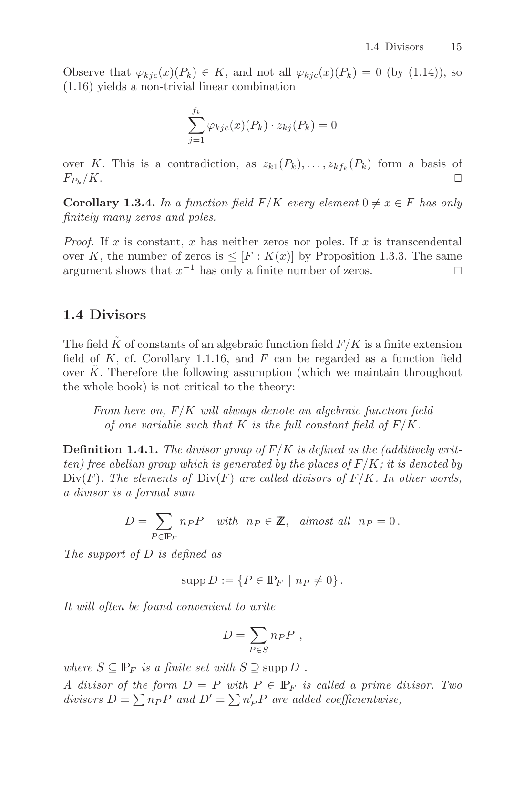
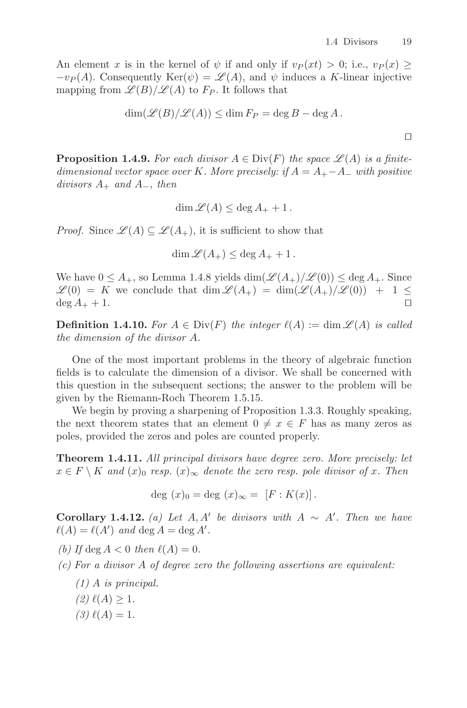

# `CoordRingElt.divisorClass_isPrincipal_of_not_const_unit`

- **Lean source**: `Divisor/OrdP/LocalRing.lean`
- **Re-exported as theorem**: `CoordRingElt.divisorClass_isPrincipal` (the unrestricted form, derived from this narrowed axiom plus the trivial constant-unit case).

```lean
axiom CoordRingElt.divisorClass_isPrincipal_of_not_const_unit
    (D : CoordRingElt E.q) (_hD : ¬ (D.a = 0 ∧ D.b = 0))
    (_hSplit : splitsOnE E D)
    (_hNotConstUnit :
      ¬ ∃ c : ZMod E.q, c ≠ 0 ∧ D.a = Polynomial.C c ∧ D.b = 0) :
    ∃ I : (FractionalIdeal (nonZeroDivisors E.toW.toAffine.CoordinateRing)
              (FractionRing E.toW.toAffine.CoordinateRing))ˣ,
      (I : Submodule E.toW.toAffine.CoordinateRing
            (FractionRing E.toW.toAffine.CoordinateRing)).IsPrincipal ∧
      Additive.toMul
        (divisorClass E (divisorOfD E D)
          (divisorOfD_finiteSupport E D)) =
      ClassGroup.mk I
```

This is the remaining function-field bridge behind the proved theorem
`CoordRingElt.exists_divisor_multiplicity`.

It says that the concrete divisor attached to the regular function
`D = a - b*y`,

```text
sum_P ord_P(D) * (P) - natDegree(normPoly E D) * (infinity),
```

is represented in mathlib's class group by a principal fractional
ideal, once `splitsOnE E D` ensures all relevant geometric divisor
mass is visible over `F_q`.

## Why this is the current boundary

The old bridge axiom was the already-unwrapped statement
`ordAt_divisorClass_zero`. That statement is now a theorem: Lean gets
it from this axiom using mathlib's `ClassGroup.mk_eq_one_iff`.

This is still not the final trust boundary, but it is closer to the
standard algebraic statement. The remaining mathematical work is to
identify the project's explicit `ordAt` divisor with the principal
divisor of the coordinate-ring element `D`.

Pinned closure:

```lean
#print axioms Divisor.CoordRingElt.exists_divisor_multiplicity
-- propext, Classical.choice, Quot.sound,
-- Divisor.CoordRingElt.divisorClass_isPrincipal_of_not_const_unit
```

## Citation

The axiom statement is Abel's theorem applied to the explicit divisor
of `D = a - b·y` viewed in the affine coordinate ring of `E`:

* Silverman, *The Arithmetic of Elliptic Curves* (GTM 106, 2nd ed.):
  - **§II.3** (printed pp. 27–28): definition of `div(f)` for a rational
    function, valuations at smooth points;
  - **§III.3 Corollary 3.5** (printed p. 63): degree-zero divisor is
    principal iff its group-law sum is zero.
* Stichtenoth, *Algebraic Function Fields and Codes* (GTM 254, 2nd ed.):
  - **Definition 1.4.1** + **Theorem 1.4.11** (printed pp. 19–20):
    `(x) ∈ Princ(F)` for `x ∈ F^×` — the trivial direction of the
    principal-class statement actually used.

The trivial direction (every nonzero rational function gives a
principal class) is the one this axiom needs; III.3.5 is the
characterisation, more general than required.

Mathlib supplies the class-group interface used by the derivation:

* `ClassGroup.mk_eq_one_iff`;
* `WeierstrassCurve.Affine.Point.toClass`;
* `WeierstrassCurve.Affine.Point.toClass_eq_zero`.

Note: `Point.toClass` does **not** short-circuit the discharge. Going
from `divisorClass E (divisorOfD E D) = 0` via `Point.toClass_eq_zero`
to an `ECPoint` group-sum statement is clean *if* you already know
the equality; it does not prove that the coefficients in
`divisorOfD E D` are the divisor of `(a - b·y)` in the first place.
The local-order bridge (item 1 below) is unavoidable.

## Snippets







## Discharge target

To remove this axiom, prove that `divisorOfD E D` is the divisor class
of the rational function represented by `D` in the coordinate ring. The
concrete proof obligations are:

1. identify the project `ordAt E D P` with the local valuation of `D`
   at each affine smooth point `P` (the `(X - x_0, Y - y_0)`-adic
   valuation in `Localization.AtPrime`); this proceeds by induction on
   the recursive `ordAt_nonTwoTorsion_aux` (lone/twin trichotomy),
   matching each step against successive divisions by the local
   uniformiser. The 2-torsion case dispatches via the closed form
   `ordAt_twoTorsion_eq_rootMult_normPoly`;
2. identify the pole order at infinity with `natDegree(normPoly E D)`,
   using `(a - b·y)·(a + b·y) = a² - b²(X³ + AX + B) = normPoly E D`
   in the coordinate ring (norm-of-conjugates) plus the rank-2
   structure of the coordinate ring over `F_q[X]`;
3. use the standard class-group fact that a principal fractional ideal
   has trivial class (mathlib's `ClassGroup.mk_eq_one_iff`); construct
   the principal generator as
   `FractionalIdeal.spanSingleton _ (algebraMap _ _ (a - b·y))`.

The first item is the main formalisation work; the rest is bookkeeping
once the local-order compatibility theorem exists.
