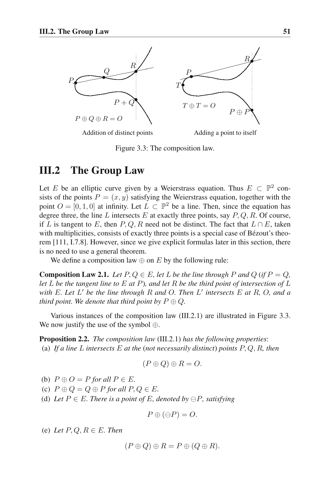

# `ECPoint.add_comm`

- **Lean source**: `Divisor/Defs.lean:193`

```lean
axiom ECPoint.add_comm (E : ECSetup) (p q : ECPoint E.q) :
    ECPoint.add E p q = ECPoint.add E q p
```

## Citation

Silverman, *The Arithmetic of Elliptic Curves* (GTM 106), **Proposition III.2.2(c)**, p. 51.

## Verbatim

> Proposition 2.2. The composition law (III.2.1) has the following properties:
> …
> (c) P ⊕ Q = Q ⊕ P for all P, Q ∈ E.

## Snippet



## Notes

Follows immediately from symmetry of the chord construction (the line through P and Q is the same as the line through Q and P). We take it as an axiom to avoid re-doing the case split on infinity / identical-x branches for our concrete `ECPoint.add` implementation.
