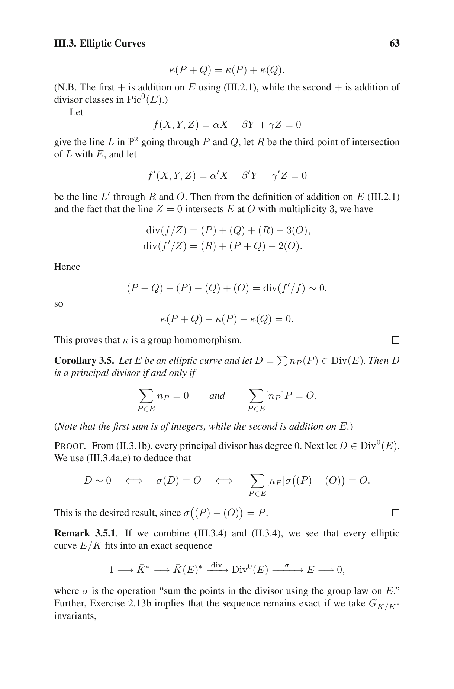
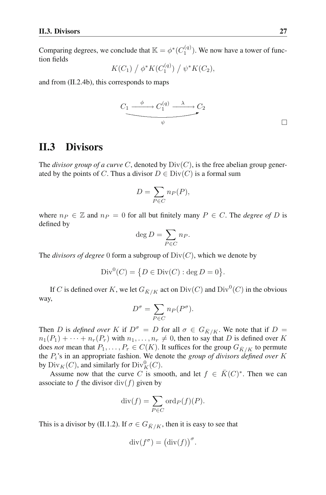
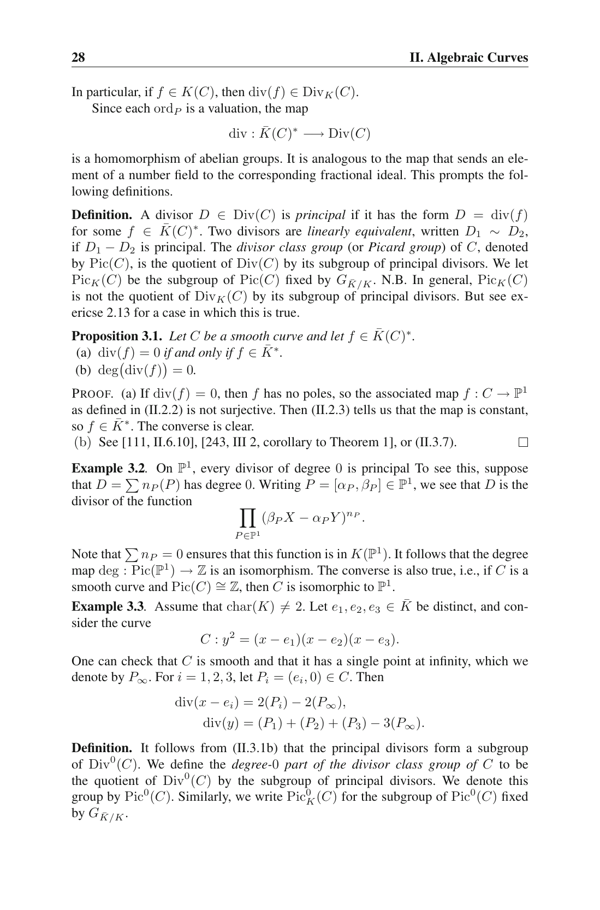

# `CoordRingElt.exists_divisor_multiplicity`

- **Lean source**: `Divisor/Axioms/AxiomExistsDivisorMultiplicity.lean`

```lean
theorem CoordRingElt.exists_divisor_multiplicity
    (D : CoordRingElt E.q) (hD : ¬ (D.a = 0 ∧ D.b = 0)) :
    ∃ β : ZMod E.q × ZMod E.q → ℕ,
      (∀ P, β P ≠ 0 → P ∈ E.points ∧ D.eval P.1 P.2 = 0) ∧
      (∀ P ∈ E.points, D.eval P.1 P.2 = 0 → β P ≠ 0) ∧
      (∑ P ∈ E.points, β P) ≤ D.degE ∧
      (splitsOnE E D →
        (∑ P ∈ E.points, β P) = (normPoly E D).natDegree) ∧
      (splitsOnE E D →
        ECPoint.weightedSum E E.points
          (fun P => ECPoint.nsmul E (β P) (ECPoint.affine E P.1 P.2)) = 0)

def splitsOnE (D : CoordRingElt E.q) : Prop :=
  normPoly_splits_over_Fq E D ∧
  (∀ α ∈ (normPoly E D).roots, ∃ y : ZMod E.q, (α, y) ∈ E.points)
```

Existence of the canonical "true divisor multiplicity" function
`β = ord_P(D)` for `D = a − b·y ∈ F_q[E]^×`, with the four divisor
properties:

1. **Support**: `β` is supported only on F_q-rational affine zeros of `D` on `E`.
2. **Coverage**: every F_q-rational affine zero of `D` is in `β`'s support.
3. **Total-degree bound** (unconditional): `Σ β ≤ D.degE`.
4. Under `splitsOnE E D`:
   - **Pole-at-∞ accounting**: `Σ β = natDegree (normPoly E D)`.
   - **Abel's group-sum-zero**: `Σ [β(P)]·P = O` in the group law.

## Why this exists (and the previous axiom did not)

This axiom replaces the now-retired
[`CoordRingElt.divisor_group_sum_zero`](coordringelt_divisor_group_sum_zero.md),
which had hard-coded `β = betaConstructive E D`. That binding was
provably false (counterexample over `F_5`); see the retired-axiom
provenance file for details.

The fix: existential rather than constructive. The witness is the
true local order `ord_P(D)`, which lives in Silverman AEC II §1
(local discrete valuation at a smooth point) and gives the full
group-sum content of Cor III.3.5 (specialised under splitting).

## A second falsity (caught after v2; fixed in v3)

The first existential form gated accounting / group-sum-zero on
`normPoly_splits_over_Fq E D` alone — i.e. just polynomial-in-X
splitting. That was not enough: a root `α` of `normPoly` might have
no F_q-rational `(α, y)` on `E` if `α³ + Aα + B` isn't a square in
F_q.

Counterexample (auditor): `E : y² = x³ + 1 / F_5`, `D = X − 1`.
`normPoly D = (X − 1)²` splits over F_5 with `natDeg = 2`, but
`1³ + 1 = 2` isn't a QR mod 5, so no F_5-points have `x = 1`. The
F_q-restricted β was therefore forced to vanish above `x = 1`, but
the axiom claimed the multiplicity sum equals 2.

Fix (v3): replaced `normPoly_splits_over_Fq` by the strictly
stronger predicate `splitsOnE` (defined above), which adds the
fiber-rationality clause: *every root of `normPoly E D` lifts to
at least one F_q-rational point of E*. Under `splitsOnE`, every
geometric zero of `D` on `E` IS F_q-rational, so the F_q-sum
captures the full Cor III.3.5 content.

## Current status

This is no longer an axiom. It is theorem-backed by
`Divisor.exists_divisor_multiplicity_proved` in
`Divisor/OrdP/LocalRing.lean`, with witness `ordAt E D`.

There is also an `ECPoint`-indexed theorem for internal use:

```lean
theorem CoordRingElt.exists_divisor_multiplicity_ecpoint
    (D : CoordRingElt E.q) (hD : ¬ (D.a = 0 ∧ D.b = 0)) :
    ∃ β : ECPoint E → ℕ, ...
```

It sums over `ECPoint.affinePoints E`, uses
`CoordRingElt.evalPoint E D`, and avoids raw coordinate-pair indexing
except at the protocol boundary.

The remaining axiom in its dependency closure is the narrower
`Divisor.CoordRingElt.divisorClass_isPrincipal_of_not_const_unit`,
documented separately in
[`divisorClass_isPrincipal.md`](divisorClass_isPrincipal.md). The
old `Divisor.ordAt_divisorClass_zero` statement is now a theorem
derived from that axiom and mathlib's `ClassGroup.mk_eq_one_iff`. The
unrestricted form `Divisor.CoordRingElt.divisorClass_isPrincipal` is
also a re-exported theorem (case-split between the trivial
constant-unit case and the narrowed axiom).
The closure is pinned in `Tests/AxiomClosurePin.lean`:

```lean
#print axioms Divisor.CoordRingElt.exists_divisor_multiplicity
-- propext, Classical.choice, Quot.sound,
-- Divisor.CoordRingElt.divisorClass_isPrincipal_of_not_const_unit
#print axioms Divisor.CoordRingElt.exists_divisor_multiplicity_ecpoint
-- propext, Classical.choice, Quot.sound,
-- Divisor.CoordRingElt.divisorClass_isPrincipal_of_not_const_unit
```

## Citation

Silverman, *The Arithmetic of Elliptic Curves* (GTM 106):

* **§II.1** (p. 21–24): local rings, uniformizers, and the discrete
  valuation `ord_P` at a smooth point of an algebraic curve.
* **Corollary III.3.5**, p. 63: principal-divisor characterisation
  via degree zero + group-sum zero.

Combined: the local order `ord_P(D)` at affine F_q-points of `E`
provides a multiplicity function whose F_q-sum (under splitting)
matches Cor III.3.5's full geometric sum, hence the four divisor
properties.

## Verbatim (Cor III.3.5)

> Corollary 3.5. Let E be an elliptic curve and let
> D = Σ n_P (P) ∈ Div(E). Then D is a principal divisor if and only if
>
> Σ_{P ∈ E} n_P = 0     and     Σ_{P ∈ E} [n_P] P = O.







## Discharge history

The former axiom was discharged in Phase 1 of the trust-closure plan:

1. Mechanise `ord_P` from local uniformizers (`Divisor/OrdP/Uniformizer.lean`):
   - Non-2-torsion `P = (x₀, y₀)` with `y₀ ≠ 0`: uniformizer = `x − x₀`.
   - 2-torsion `P = (x₀, 0)`: uniformizer = `y`.
2. Prove the four divisor properties for `ord_P` in
   `Divisor/OrdP/LocalRing.lean`.
3. Derive `ordAt_divisorClass_zero` from
   `CoordRingElt.divisorClass_isPrincipal` and mathlib's
   `ClassGroup.mk_eq_one_iff`, then use mathlib's `Point.toClass_eq_zero`
   to obtain group-sum-zero under splitting.
4. Replace the axiom with the proven theorem
   `Divisor.exists_divisor_multiplicity_proved` in
   `Divisor/OrdP/LocalRing.lean`.

## Notes

The splitting hypothesis is essential for (4) and (5). Without
splitting, conjugate orbits `{P, P^φ}` in `E(F_{q^r}) \ E(F_q)`
contribute to the geometric sum but are invisible to the
F_q-restricted sum, so the F_q-only group sum is in general nonzero
even though the geometric one is `O`. Splitting forces every
geometric zero of `D` to be F_q-rational, recovering the full sum.
