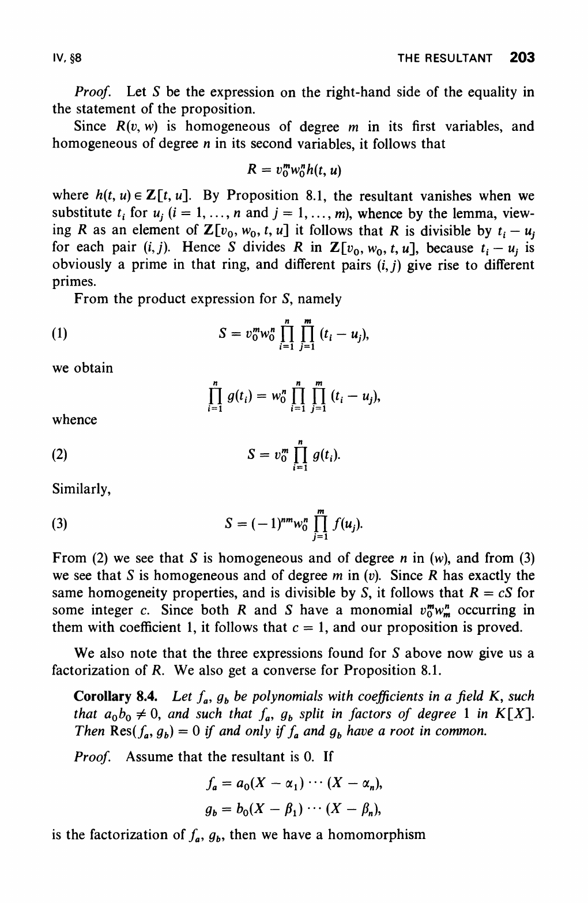

# `Polynomial.resultant_logDeriv_at_split_specialization_of_pos_natDegree_pos_g`

- **Lean source**: `Divisor/Axioms/AxiomResultantLogDerivAtSplit.lean`
- **Downstream consumer**: `chord_fiber_product_logDeriv_eq_logDerivTerm_trace` in `Divisor/Axioms/AxiomChordSumEqChordFiberProductLogDeriv.lean` (now a theorem). The downstream consumer uses the unrestricted name `Polynomial.resultant_logDeriv_at_split_specialization`, which is a theorem that case-splits on `f.natDegree` and `g.natDegree` and dispatches to either a trivial-case theorem or to this narrower axiom.
- **Status**: temporary generic bridge axiom. It is intentionally less
  project-specific than the old chord axiom, but it is still a composed
  polynomial/resultant specialization and is not the final trust boundary.
  Now narrowed to the case `0 < f.natDegree ∧ 0 < g.natDegree`. The
  trivial `f.natDegree = 0` case is a theorem (under `Monic`,
  `f.natDegree = 0 ⇒ f = 1`, so the resultant is 1 and both sides of the
  identity are 0). The trivial `g.natDegree = 0` case is a theorem
  (`g = C h`, `Res_X(f, g) = h^{f.natDegree}`, log-derivative is
  `f.natDegree · h'(t₀)/h(t₀)`, matching the chord-root multiset sum
  with `f.natDegree` constant summands).

## Statement

For `f, g : K[T][X]` (a bivariate polynomial pair, with the *outer* `Polynomial.X` playing the resultant variable and the *inner* `Polynomial.X` the specialization parameter `T`) and `t₀ : K`, set `F(T) := Res_X(f, g) ∈ K[T]`. Under the hypotheses

- `f.Monic` (in the outer variable). Without monicity, mathlib's `Polynomial.resultant_eq_prod_eval` carries an extra `lc(f)^{deg g}` factor, and the per-root sum picks up a corresponding `d/dT log(lc(f)^{deg g})` term. The project's caller `chordCubicBiv` is monic, so we keep the simpler statement.
- `F(t₀) ≠ 0`,
- `f(X, t₀) := f.map (evalRingHom t₀)` splits over `K`,
- `g(x, t₀) ≠ 0` for every chord root `x` of `f(X, t₀)`,
- `f_X(x, t₀) ≠ 0` (the outer X-derivative; rules out double roots),

the formal logarithmic derivative of the resultant equals a multiset sum of per-chord-root contributions:

```
F'(t₀) / F(t₀) =
  Σ_{x ∈ f(X, t₀).roots}
    (g_T(x, t₀) · f_X(x, t₀) - g_X(x, t₀) · f_T(x, t₀)) /
    (f_X(x, t₀) · g(x, t₀))
```

where partial derivatives are encoded directly via `Polynomial.derivative` and `Polynomial.eval`:

- `f_X(x, t₀) := ((f.map (evalRingHom t₀)).derivative).eval x`,
- `f_T(x, t₀) := ((f.eval (C x)).derivative).eval t₀`,
- `g_X`, `g_T` analogously, and
- `g(x, t₀) := (g.map (evalRingHom t₀)).eval x`.

The numerator `g_T · f_X − g_X · f_T` is the standard implicit-function chain-rule combination for `d/dt [g(x(t), t)]` along a moving root `x(t)` defined by `f(x(t), t) = 0`.

## Citation

Lang, *Algebra* (3rd ed., GTM 211):

- **§VI.5 Theorem 5.1**, p. 285 — multiplicativity of the norm and the product-of-embeddings formula `N^E_k(α) = ∏_σ σα`.
- **§VIII.5 Theorem 5.1 Case 1**, p. 370 — a derivation extends uniquely to a separable algebraic extension via the implicit-function formula `ξ′ = -f^D(ξ)/f'(ξ)`.
- **§IV.8 Proposition 8.1 / 8.3**, pp. 200–202 — resultant as a product over roots, i.e. `Res(f, g) = lc(f)^{deg g} · ∏_α g(α)` for monic `f` (and the `lc(f)^{deg g}` correction in the non-monic case). This is the bridge that identifies `Res_X(f, g)` with the function-field norm `N_{L/K(T)}(g)` once `L` is a splitting field of `f` over `K(T)`. Mathlib's `Polynomial.resultant_eq_prod_eval` (`Mathlib/RingTheory/Polynomial/Resultant/Basic.lean`) supplies this in mechanised form; the `Monic` hypothesis on the axiom is exactly what makes the leading-coefficient factor disappear.

The identity is the trace-of-log-derivative formula `Tr_{L/K}(dα/α) = d N_{L/K}(α) / N_{L/K}(α)` specialised to the bivariate resultant: `F = Res_X(f, g)` is the norm of `g` from the splitting field `L = K(T)[ξ_1, …, ξ_n]/(f)` down to `K(T)` (via Lang IV.8), and the per-root sum is the trace of the log-derivative of `g` along the moving roots. The needed Galois norm/trace/log-derivative identity is already proved in Lean as `Differential.logDeriv_algebraNorm_eq_algebraTrace_logDeriv_of_isGalois`.

## Snippets





## Discharge plan

The mathlib infrastructure for mechanizing the discharge exists modulo plumbing:

1. **Splitting field.** Construct `L := Polynomial.SplittingField (f : K(T)[X])`; the chord roots `ξ_1, …, ξ_n ∈ L` lift the `K`-roots of `f(X, t₀)` after specialisation.

2. **Extension of derivation.** Use `Differential.deriv_aeval_eq_implicitDeriv` (in `Mathlib.RingTheory.Derivation.MapCoeffs`) to extend the formal `T`-derivation on `K[T]` to `L` via the implicit-function formula `ξ_i′ = -f^D(ξ_i)/f'(ξ_i)`. This is exactly Lang VIII.5 Theorem 5.1 Case 1, mechanised.

3. **Norm/trace log derivative.** Apply the proved Galois theorem
   `Differential.logDeriv_algebraNorm_eq_algebraTrace_logDeriv_of_isGalois`
   to `α := g(ξ)`, then identify the norm with the resultant and the trace
   with the root sum.

4. **Specialisation.** Specialise both sides at `T = t₀`. The `K(T)`-roots `ξ_i` that are separable specialise to the chord roots in `K`, and the per-summand expression collapses to the stated chain-rule combination via direct calculation.

The bridge between `Polynomial.derivative` on `K[T]` (the formal-derivative function) and the `Differential` instance on the splitting field `L` is the only missing bit of mathlib infrastructure. Once added, this axiom becomes a theorem.

## Boundary status

This axiom is a useful narrowing of the previous project-shaped axiom
`chord_fiber_product_logDeriv_eq_logDerivTerm_trace`. The chord-specific
identity is now a theorem in
`Divisor/Axioms/AxiomChordSumEqChordFiberProductLogDeriv.lean`, derived from
this axiom plus chord-cubic-specific algebra. The final goal is to turn this
generic resultant statement into a theorem from the proved Galois
norm/trace/log-derivative identity plus resultant and specialization
plumbing.
