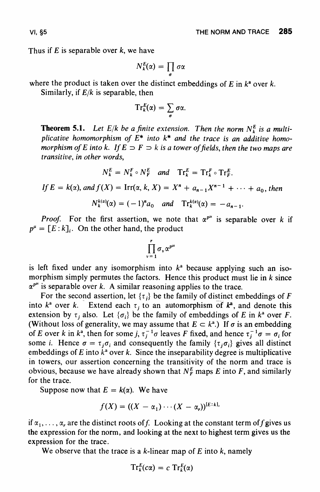
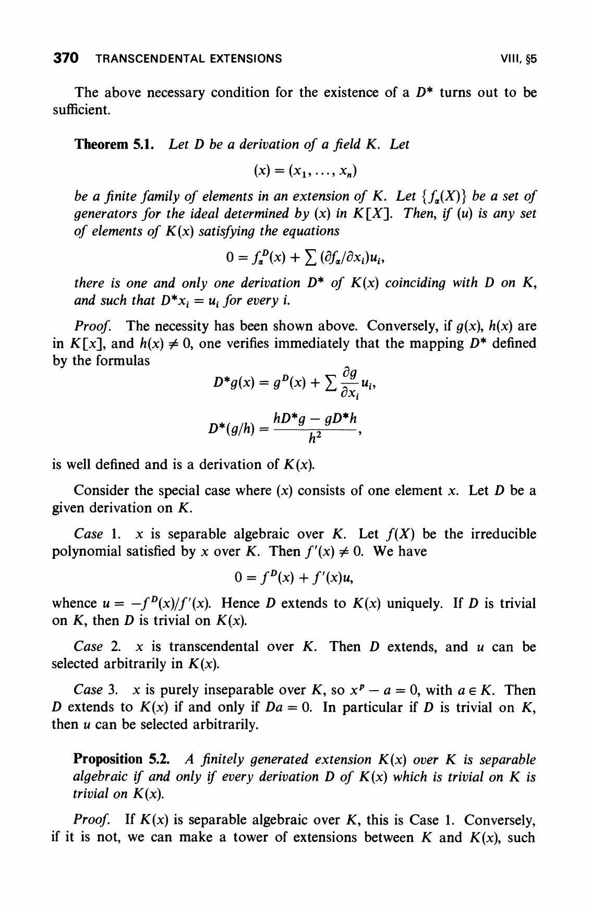

# `Differential.logDeriv_algebraNorm_eq_algebraTrace_logDeriv`

- **Lean source**: `Divisor/Axioms/AxiomTraceLogDeriv.lean`
- **Status**: Galois case proved from mathlib; broader finite-separable
  statement kept as a temporary target axiom.
- **Replaces (planned)**: `Polynomial.resultant_logDeriv_at_split_specialization` in `AxiomResultantLogDerivAtSplit.lean`, which is a combined form awaiting discharge.

## Statement

For a finite separable field extension `F → K` between differential fields where the derivation extends compatibly, and for any nonzero `α ∈ K`:

```
logDeriv (Algebra.norm F α) = Algebra.trace F K (logDeriv α)
```

This is **the** trace-of-logarithmic-derivative formula in differential Galois theory: the logarithmic derivative of the norm equals the trace of the logarithmic derivative.

## Citation

Lang, *Algebra* (3rd ed., GTM 211):

- **§VI.5 Theorem 5.1**, p. 285 — `N^E_k(α) = ∏_σ σα` and `Tr^E_k(α) = Σ_σ σα` over the distinct embeddings of `E` in `k^a`.
- **§VIII.5 Theorem 5.1 Case 1**, p. 370 — for `ξ` separable algebraic over `K` with minimal polynomial `f`, the derivation `D` extends uniquely to `K(ξ)` via the implicit-function formula `D ξ = -f^D(ξ) / f'(ξ)`.

The trace-of-log-derivative formula is the one-line corollary: differentiate `N(α) = ∏_σ σα`, use the product rule + Galois-equivariance of the extended derivation (§VIII.5 Case 1), recognize the resulting sum as `Tr(α'/α)`.

## Snippets





## Lean status

The case needed by the splitting-field route is now a theorem:

```
Differential.logDeriv_algebraNorm_eq_algebraTrace_logDeriv_of_isGalois
```

It assumes `[IsGalois F K]` and proves the formula from mathlib's
existing product/sum formulas:

- `Differential.algEquiv_deriv'` (in `Mathlib.RingTheory.Derivation.MapCoeffs`) — derivations commute with `K`-algebra automorphisms when the extension is separable.
- `Differential.logDeriv_prod` (in `Mathlib.FieldTheory.Differential.Basic`) — logDeriv of a product is a sum.
- `Algebra.norm_eq_prod_automorphisms` / `trace_eq_sum_automorphisms` — norm/trace as products/sums over Galois automorphisms.

The broader finite-separable statement

```
Differential.logDeriv_algebraNorm_eq_algebraTrace_logDeriv
```

remains as a temporary target axiom only if a non-Galois version is needed
directly. The intended resultant discharge should avoid it by working over
the splitting field, where the proved Galois theorem applies.

## Why this replaces the resultant log-derivative axiom

The current resultant log-derivative axiom

```
F'(t₀) / F(t₀) = Σ_{x ∈ f(X, t₀).roots}
                   (g_T · f_X − g_X · f_T) / (f_X · g) (x, t₀)
```

is a *project-side composition* of three textbook facts:

1. **Lang VI.5**: `Algebra.norm L K (g(ξ)) = ∏_σ σ(g(ξ)) = ∏_i g(ξ_i, T)` over the conjugates `ξ_i` of a root `ξ` of `f` over `K(T)`.
2. **Lang VIII.5 Case 1**: `ξ_i'(T) = -f^D(ξ_i, T) / f'(ξ_i, T)` for each conjugate.
3. **`Polynomial.resultant_eq_prod_eval`** (mathlib theorem): `Res_X(f, g) = (lc f)^{deg g} · ∏_i g(ξ_i, T)` when `f` splits.

Compositing the three (and applying logDeriv via the proved Galois theorem
over the splitting field) gives the resultant log-derivative formula. Each
ingredient is textbook; the composition is then a project theorem, not an
axiom.

The bridge from this trace-of-log-derivative axiom down to the resultant log-derivative formula at a split specialisation point requires:

1. A `Differential` instance on `K(T) = RatFunc K` with `T' = 1`.
2. Construction of the splitting field `L` of `f` over `K(T)`, with the derivation extended to `L` via `Differential.deriv_aeval_eq_implicitDeriv` (mathlib has this).
3. Identifying `Algebra.norm K(T) L (g(ξ))` with `Res_X(f, g) / (lc f)^{deg g}` (using `Polynomial.resultant_eq_prod_eval` + Lang VI.5).
4. Specialisation: pulling the K(T)-valued identity at the generic `T` back to a K-valued identity at a specific `T = t₀`, using ordinary polynomial / rational function evaluation.

This bridge is project-side Lean engineering. It is the path to making the
resultant log-derivative formula a *theorem* and removing it from the axiom
closure entirely.

## Status today

- The Galois Lang formula is proved from mathlib and is not an axiom.
- The broader finite-separable Lang formula remains declared as a temporary
  axiom, but it is not in the headline closure.
- The `Polynomial.resultant_logDeriv_at_split_specialization` axiom (the
  combined form) remains active in the headline closure.
- The discharge plan above is the path to removing the combined-form axiom
  entirely by deriving it from the proved Galois Lang formula plus resultant
  and specialization algebra.
